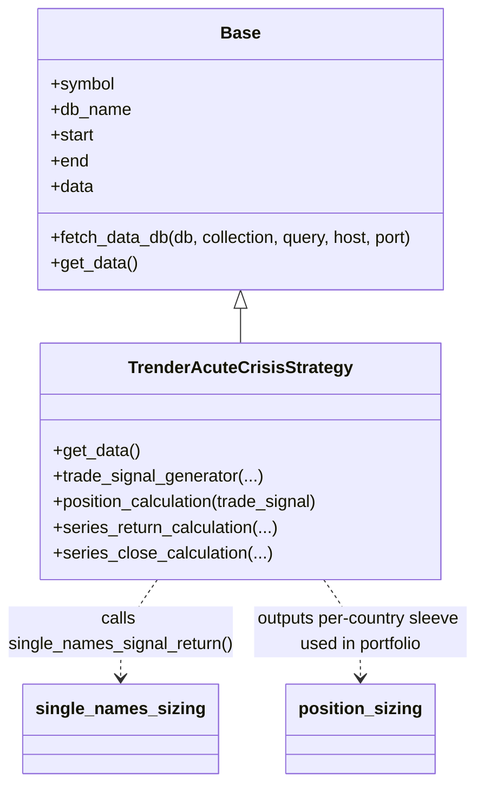
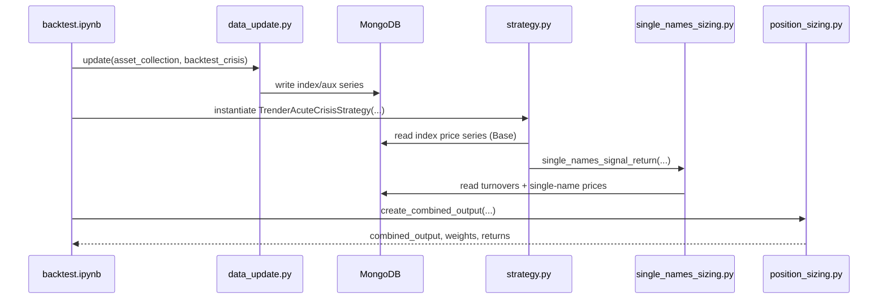
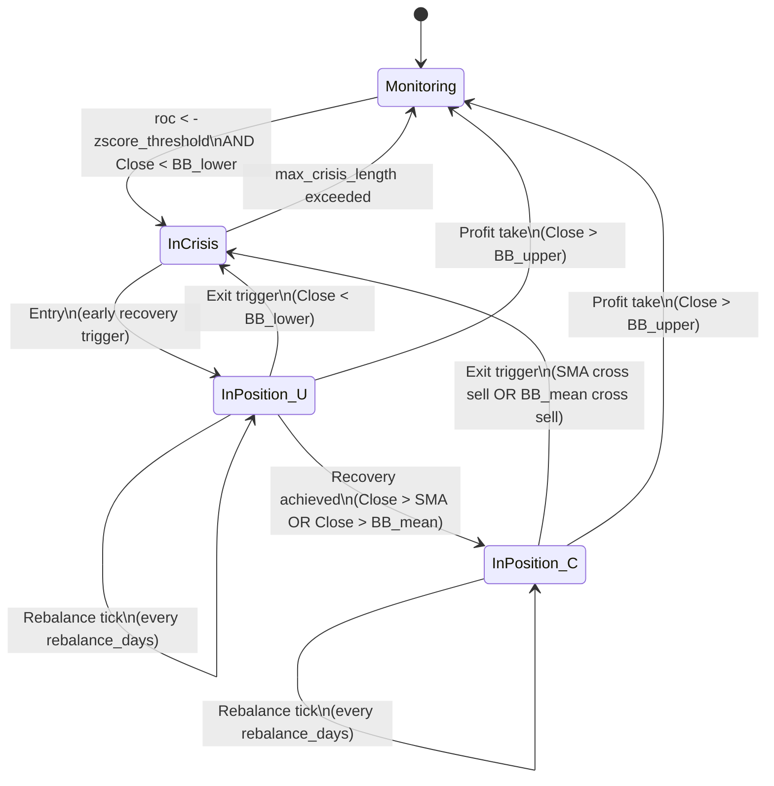

# Live Trading Strategies (Windows) — Documentation

This document explains the **live trading strategies** area of this repository, with the current scope limited to **Strategy 1: Macro Bollinger Vol Target – Breakout**.

> Technical Note: In this codebase, “live strategy” largely means **signal generation + position sizing + portfolio weights** (often run from notebooks). I do not see a full broker/order-routing layer in the repository.

## What’s included / known gaps

**Included (from code):** strategy logic, parameters, data flow (MongoDB), Bloomberg data ingestion utilities (`xbbg`), and how the Strategy 1 backtest notebook runs end-to-end.

**LACKING:** VPN details (vendor, URLs), remote hostnames/IPs, MongoDB credentials/topology, Bloomberg API installation/licensing steps, and real order execution process.

## Repository map (relevant)

- Strategy 1 folder:
  - `live strategies\1. [macro bollinger] vol target - breakout\strategy.py` (signals)
  - `...\single_names_sizing.py` (single-name selection + weights)
  - `...\position_sizing.py` (combine countries into a portfolio)
  - `...\portfolio.py` (list of country indices + configs)
  - `...\base.py` (MongoDB price-series loader)
  - `...\helper.py` (Mongo helpers + BBG single-name fetch/update)
  - `...\backtest.ipynb` (main runnable notebook)
- Data ingestion:
  - `data_update.py` (Bloomberg → MongoDB for index/aux series)

### High-level data flow

```mermaid
flowchart LR
    BBG[Bloomberg (xbbg / blp)] -->|bdh()| DU[data_update.py]
    DU -->|insert/update| MDB[(MongoDB)]

    MDB --> DBIDX[DB: backtest_crisis\nCollections: country/index series]
    MDB --> DBTO[DB: single_names\nCollection: turnovers (ticker,date,turnover)]
    MDB --> DBSN[DB: backtest_single_names\nCollections: 1 per BBG ticker]

    DBIDX --> ST[TrenderAcuteCrisisStrategy\n(strategy.py)]
    DBTO --> SN[single_names_sizing.py]
    DBSN --> SN

    ST --> SN
    SN --> PS[position_sizing.py\n(combine sleeves)]
    PS --> OUT[Outputs\nindividual output/\ncombined output/]
```

### Class diagram (Strategy 1)



### Sequence diagram (typical notebook run)


## Windows setup (recommended)

### Install Python
- Install **Python 3.10** (mentioned in repo root README).
- Verify in PowerShell:

```powershell
py -3.10 --version
```

### Create and activate a venv
From the repository root:

```powershell
py -3.10 -m venv .venv
.\.venv\Scripts\Activate.ps1
python --version
```

> Technical Note: If PowerShell blocks activation, you may need an ExecutionPolicy change set by IT.

### Dependencies / requirements.txt (derived from imports)
There is no pinned dependency file in the repo. Based on **Python + notebook imports**, a practical `requirements.txt` is:

```txt
# Core
numpy
pandas
pymongo
python-dateutil

# Bloomberg data access (requires Bloomberg + blpapi installed)
xbbg

# Common analytics used elsewhere in repo / notebooks
matplotlib
scipy
scikit-learn
jupyter
openpyxl

# Optional (only if you use those notebooks/modules)
backtesting
pdblp
TA-Lib
# bql  (Bloomberg BQL python package; availability depends on your environment)
```

Install:

```powershell
pip install -r requirements.txt
```

## Infrastructure & connectivity

### Remote machine via VPN
This project is typically used on a **remote Windows machine accessed over VPN**.
- MongoDB and Bloomberg access happen **on this remote machine**.

### MongoDB (database)
MongoDB is used as the project’s **time-series data store**.
- Index/country price history is read by `Base.fetch_data_db()` in `...\base.py`.
- Single-name price history is stored/read from the `backtest_single_names` database in `single_names_sizing.py`.

> Technical Note: Most code assumes `localhost:27017`. Collections generally contain a `Date` field and OHLCV-like fields (at minimum `Close`).

### Studio 3T (MongoDB GUI)
To connect in **Studio 3T**:
1. **Connect** → **New Connection**
2. Set host/port (commonly `localhost` / `27017`) or your VPN/remote host
3. Configure authentication only if your MongoDB requires it
4. Browse databases like `backtest_crisis`, `single_names`, and `backtest_single_names`

## Strategy 1 — Macro Bollinger Vol Target – Breakout

### What it does (plain language)
It tries to detect when a market is in a **Big crisis**, then enter after **early recovery signals**, and allocate capital to a set of liquid single stocks **only when they are breaking out to new recent highs**.

Analogy: it’s like waiting for a storm (crisis), then investing once the weather starts clearing—*but only in the boats already moving fastest (breakouts)*. A Country does never break.

### Key concepts
- **Bollinger Bands:** a moving average plus/minus a multiple of recent volatility.
- **Breakout:** price reaching the highest level of the last *N* days.
- **Volatility targeting (here):** weight stocks by **inverse recent volatility** (less volatile → larger weight), then cap per-name weight.
- **Turnover:** total *dollars traded per day* (price × volume), used as a liquidity proxy. For example, if a stock trades 100,000 shares in a day at $5 each, its turnover is 500,000.
- **ROC (Rate of Change):** the percentage change over a lookback window.
  - In this strategy, `roc_momentum` is computed over `roc_momentum_lookback`, and then converted into a **z-score** (`roc`) using a rolling mean/std over `roc_distribution_window`.
  - Intuition: it measures whether the recent move is *unusually negative* compared to recent history (used to detect “crisis” conditions).
- **SMA (Simple Moving Average):** the average of the last *N* closing prices.
  - Here, `sma_trade` acts as a trend filter and a control signal (via SMA cross events).
- **Mean reversion:** the idea that after an extreme move, price often “snaps back” toward a typical level.
  - In this strategy, the “crisis” + recovery entry is a mean-reversion-style component (entering as the market recovers from being extremely oversold).
- **Trend following:** the idea of participating when price shows sustained strength (and exiting on weakness).
  - In this strategy, the **breakout filter** on single names and the moving-average / Bollinger mean control behave like trend-following components.

### How it works (technical)

#### How it works diagrams

**A) End-to-end flow (from data to outputs)**

```mermaid
flowchart TD
  A[Start: index history in MongoDB]-->B[TrenderAcuteCrisisStrategy.get_data()]
  B-->C[Indicators: SMA, ROC z-score, Bollinger]
  C-->D[trade_signal_generator()\nindex_trade_signal + rebalance_signal + crisis_bottom_date]
  D-->E[index_in_position + index returns]
  E-->F[single_names_signal_return()\nliquidity + momentum + inv-vol + breakout]
  F-->G[Per-country sleeve\ntrade_signal + returns + single_names_position_size]
  G-->H[position_sizing.create_combined_output()\nmax_country_allocation + commissions]
  H-->I[Outputs\ncombined weights/returns]
```

**B) Detailed index state machine (`trade_signal_generator`)**



> Technical Note: The implementation uses flags (`in_crisis`, `in_position`, `trade_controlled_by_sma`) plus optional confirmation windows (`entry_confirmation_days`, `exit_confirmation_days`) to delay/confirm entries and exits.

**C) Detailed single-name sleeve lifecycle (`single_names_signal_return`)**

```mermaid
flowchart TD
  S[For each day i]-->Q{index_trade_signal[i]?}

  Q-- "BUY (1)" -->A[Liquidity screen\napply_turnover_threshold_screening()]
  A-->B[Fetch candidate price history\nfetch_single_names_historical_data()]
  B-->C[Momentum rank + select top N\nfetch_historical_data_by_momentum_ranking()]
  C-->D[Compute base weights\ncompute_single_names_initial_weight()\n(inv-vol, cap)]
  D-->E[Apply breakout filter\n(current >= max over breakout_window)]
  E-->H[Hold: compute daily sleeve return]

  H-->R{rebalance_signal[i]==1?}
  R--Yes-->RB[rebalance()\nre-screen + re-rank\nrecompute weights\nrebalance_size]
  RB-->N[Next day]

  R--No-->BC{any weight == 0?}
  BC--Yes-->CB[check_breakout()\n0 -> positive if breakout appears]
  CB-->N
  BC--No-->N

  Q-- "SELL (-1)" -->X[Exit sleeve\nreset weights/data]
  Q-- "HOLD (0)" -->N
  N-->S
```

**1) Country/index crisis + entry/exit** (`strategy.py`)
- Builds:
  - `roc`: z-scored rate-of-change vs a rolling distribution
  - Bollinger mean/upper/lower from `Close`
  - `sma_trade` trend filter
- Crisis signature: `roc < -zscore_threshold` **and** `Close < bollinger_lower`
- Entry (during crisis): after confirmation, go long when `Close` recovers above `bollinger_lower` (later controlled by SMA/Bollinger-mean crosses).
- Exit: confirmation-based exit if price breaks back down, **or** immediate exit on `Close > bollinger_upper`.
- Rebalance: every `rebalance_days` while in position.

**2) Single-name selection + weights** (`single_names_sizing.py`)
- Screens by liquidity using a turnovers DB (`single_names_turnovers_db_name`).
- Ranks candidates by momentum from `momentum_start_window` to `momentum_end_window` days before the signal date.
- Computes initial weights:
  - inverse-vol over `vol_lookback_days`
  - capped by `single_name_limit = max_allocation_single_name / max_country_allocation`
  - multiplied by a **breakout filter** over `breakout_window`

**3) Portfolio combination** (`position_sizing.py`)
- Combines country sleeves into one portfolio.
- Enforces `max_country_allocation` and adjusts weights as positions enter/exit.

### Data requirements (MongoDB)
At minimum:
- A DB for index history (notebook uses `backtest_crisis`) with collections named like the aliases in `portfolio.py` (e.g., `spx`, `dax`, etc.).
- A DB for turnovers (notebook uses `single_names`) with documents containing `ticker`, `date`, `turnover`.
- A DB `backtest_single_names` with collections per Bloomberg ticker (e.g., `SYDB DC Equity`) containing `Date` and `Close`.

## How to run (and “test”) Strategy 1

1. Start MongoDB on the machine where you will run the notebook.
2. Open the notebook:
   - `live strategies\1. [macro bollinger] vol target - breakout\backtest.ipynb`
3. Run all cells.

Expected outputs:
- Per-country outputs and a combined portfolio series (written under folders like `individual output\...` and `combined output\...`).

> Technical Note: `data_update.py` references a module path `common\acute crisis` that is not present in this repo snapshot; you may need to run data updates in your standard environment where that module exists, or adapt the ingestion workflow.

## Glossary
- **Signal:** a rule-based instruction like “buy” or “sell”.
- **Rebalance:** adjusting weights back toward target weights.

- **ROC (Rate of Change):** percent price change over a chosen lookback window.
- **SMA:** Simple Moving Average.
- **Turnover:** a liquidity proxy (price × volume traded per day).

