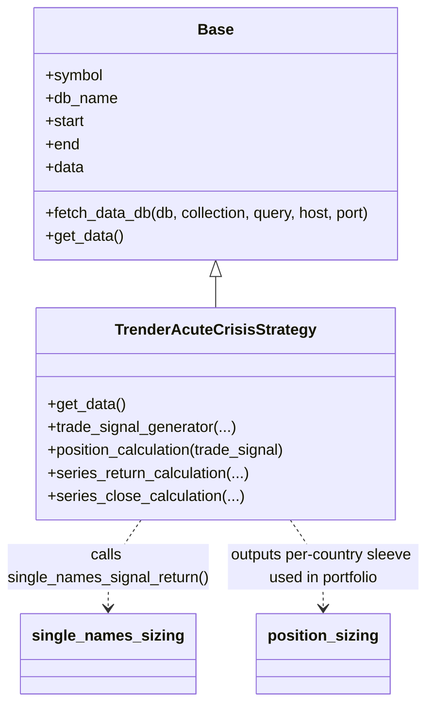
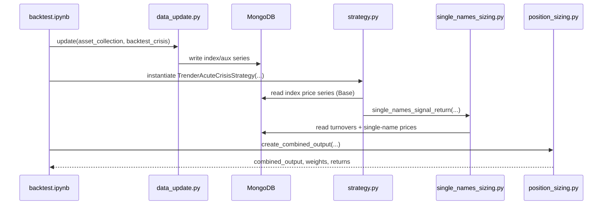

# Repository map (relevant)

- Strategy 1 folder:
    - `live strategies\1. [macro bollinger] vol target - breakout\strategy.py` (signals)
    - `...\single_names_sizing.py` (single-name selection + weights)
    - `...\position_sizing.py` (combine countries into a portfolio)
    - `...\portfolio.py` (list of country indices + configs)
    - `...\base.py` (MongoDB price-series loader)
    - `...\helper.py` (Mongo helpers + BBG single-name fetch/update)
    - `...\backtest.ipynb` (main runnable notebook)
- Data ingestion:
    - `data_update.py` (Bloomberg → MongoDB for index/aux series)

## High-level data flow

```mermaid
flowchart LR
    BBG[Bloomberg (xbbg / blp)] -->|bdh()| DU[data_update.py]
    DU -->|insert/update| MDB[(MongoDB)]

    MDB --> DBIDX[DB: backtest_crisis\nCollections: country/index series]
    MDB --> DBTO[DB: single_names\nCollection: turnovers (ticker,date,turnover)]
    MDB --> DBSN[DB: backtest_single_names\nCollections: 1 per BBG ticker]

    DBIDX --> ST[TrenderAcuteCrisisStrategy\n(strategy.py)]
    DBTO --> SN[single_names_sizing.py]
    DBSN --> SN

    ST --> SN
    SN --> PS[position_sizing.py\n(combine sleeves)]
    PS --> OUT[Outputs\nindividual output/\ncombined output/]
```

## Class diagram (Strategy 1)



## Sequence diagram (typical notebook run)


