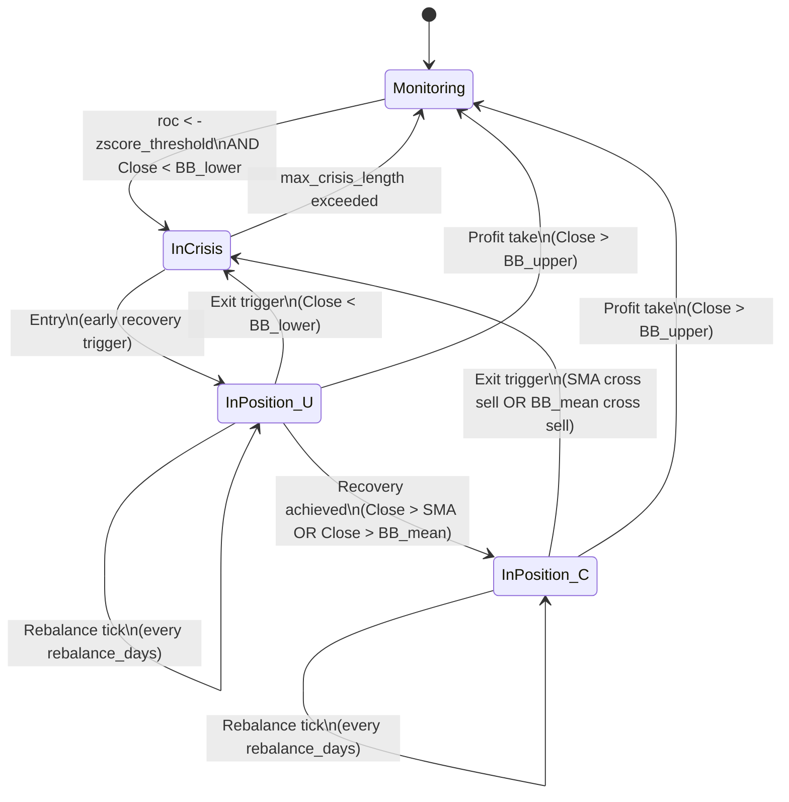

# How it works (technical)

## How it works diagrams

### A) End-to-end flow (from data to outputs)

```mermaid
flowchart TD
  A[Start: index history in MongoDB]-->B[TrenderAcuteCrisisStrategy.get_data()]
  B-->C[Indicators: SMA, ROC z-score, Bollinger]
  C-->D[trade_signal_generator()\nindex_trade_signal + rebalance_signal + crisis_bottom_date]
  D-->E[index_in_position + index returns]
  E-->F[single_names_signal_return()\nliquidity + momentum + inv-vol + breakout]
  F-->G[Per-country sleeve\ntrade_signal + returns + single_names_position_size]
  G-->H[position_sizing.create_combined_output()\nmax_country_allocation + commissions]
  H-->I[Outputs\ncombined weights/returns]
```

### B) Detailed index state machine (`trade_signal_generator`)



> Technical Note: The implementation uses flags (`in_crisis`, `in_position`, `trade_controlled_by_sma`) plus optional confirmation windows (`entry_confirmation_days`, `exit_confirmation_days`) to delay/confirm entries and exits.

### C) Detailed single-name sleeve lifecycle (`single_names_signal_return`)

```mermaid
flowchart TD
  S[For each day i]-->Q{index_trade_signal[i]?}

  Q-- "BUY (1)" -->A[Liquidity screen\napply_turnover_threshold_screening()]
  A-->B[Fetch candidate price history\nfetch_single_names_historical_data()]
  B-->C[Momentum rank + select top N\nfetch_historical_data_by_momentum_ranking()]
  C-->D[Compute base weights\ncompute_single_names_initial_weight()\n(inv-vol, cap)]
  D-->E[Apply breakout filter\n(current >= max over breakout_window)]
  E-->H[Hold: compute daily sleeve return]

  H-->R{rebalance_signal[i]==1?}
  R--Yes-->RB[rebalance()\nre-screen + re-rank\nrecompute weights\nrebalance_size]
  RB-->N[Next day]

  R--No-->BC{any weight == 0?}
  BC--Yes-->CB[check_breakout()\n0 -> positive if breakout appears]
  CB-->N
  BC--No-->N

  Q-- "SELL (-1)" -->X[Exit sleeve\nreset weights/data]
  Q-- "HOLD (0)" -->N
  N-->S
```

## 1) Country/index crisis + entry/exit (`strategy.py`)

- Builds:
    - `roc`: z-scored rate-of-change vs a rolling distribution
    - Bollinger mean/upper/lower from `Close`
    - `sma_trade` trend filter
- Crisis signature: `roc < -zscore_threshold` **and** `Close < bollinger_lower`
- Entry (during crisis): after confirmation, go long when `Close` recovers above `bollinger_lower` (later controlled by SMA/Bollinger-mean crosses).
- Exit: confirmation-based exit if price breaks back down, **or** immediate exit on `Close > bollinger_upper`.
- Rebalance: every `rebalance_days` while in position.

## 2) Single-name selection + weights (`single_names_sizing.py`)

- Screens by liquidity using a turnovers DB (`single_names_turnovers_db_name`).
- Ranks candidates by momentum from `momentum_start_window` to `momentum_end_window` days before the signal date.
- Computes initial weights:
    - inverse-vol over `vol_lookback_days`
    - capped by `single_name_limit = max_allocation_single_name / max_country_allocation`
    - multiplied by a **breakout filter** over `breakout_window`

## 3) Portfolio combination (`position_sizing.py`)

- Combines country sleeves into one portfolio.
- Enforces `max_country_allocation` and adjusts weights as positions enter/exit.
